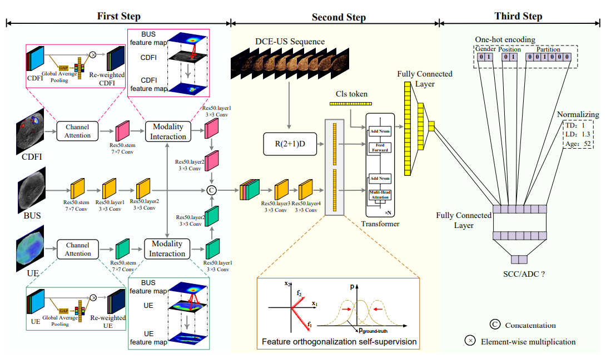
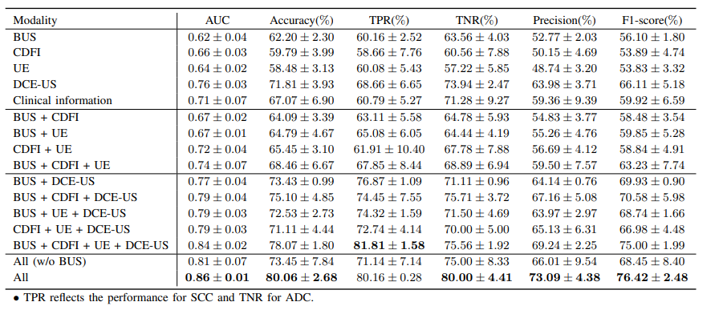
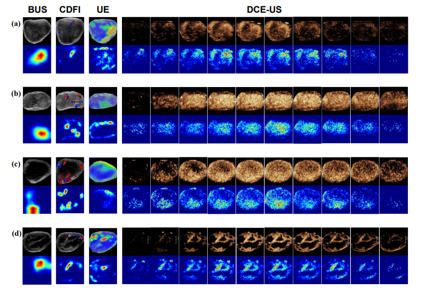

# MSMFN: Multi-Step Modality Fusion Network

## TMI Paper

This repo is created for our ***IEEE Transactions on Medical Imaging (IEEE TMI, SCI Q1, IF 11.037)*** paper: An ultrasound based multi-step modality fusion network for identifying the histologic subtypes of metastatic cervical lymphadenopathy ([Link](https://ieeexplore.ieee.org/abstract/document/9953119)). It was accepted on 13 November 2022, and completed by the authors from Chinese Academy of Sciences Institute of Automation and Lanzhou University Second Hospital.

## Multi-modal Ultrasound Fusion

The common ultrasound modalities include B-mode ultrasound (BUS), color Doppler flow imaging (CDFI), ultrasound elastography (UE) and dynamic contrast-enhanced ultrasound (DCE-US). The fusion of them is a challenges for clinicians and they cannot give satisfactory diagnosis performance on some hard problems. And there is lack of specific methods that consider the characteristics of ultrasound modalities. 

## Our Solution

We proposed the **M**ulti-**S**tep **M**odality **F**usion **N**etwork to fuse and analyse ultrasound modalities rationally. Specifically, we adopted:
 - grouping and step-by-step fusion strategy
 - modality interaction guidance machanism
 - self-supervised feature orthogonalization loss.

## Results

